# 📊 Stock Market Dashboard

A real-time stock market dashboard that provides interactive data visualization, live stock tracking, and performance analytics. This was developed as a **graduation project** by a team of six, combining front-end development, machine learning, business intelligence, and back-end development.

## 🚀 Overview

The application displays up-to-date market information, including:
- Real-time stock prices
- Historical trends
- Performance insights
- Predictive analysis using machine learning
- Interactive Power BI dashboards

Users can explore market data intuitively through dynamic UI elements and responsive design.

---

## 👨‍💻 My Role

I was part of the **front-end team** and:
- **Built the full UI** using **React** and **Bootstrap**
- Developed some components from scratch
- Ensured mobile responsiveness and optimized layout for various devices
- Translated the project’s vision into a seamless and user-friendly interface

---

## 📸 Screenshots

### 🏠 Home
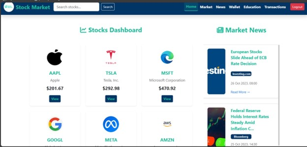

### 📊 Dashboard
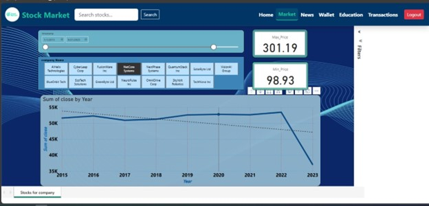

### 🔐 Login
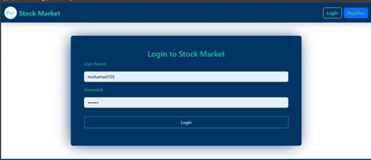

### 📝 Register


### 📚 Educational
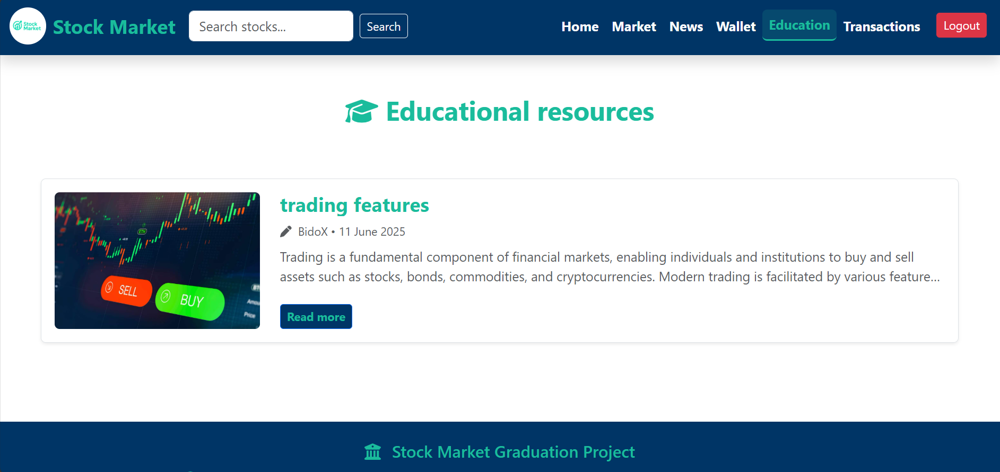

### 📰 News
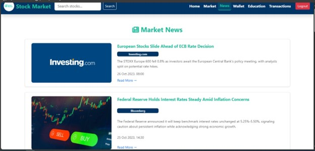

### 📰 News Details
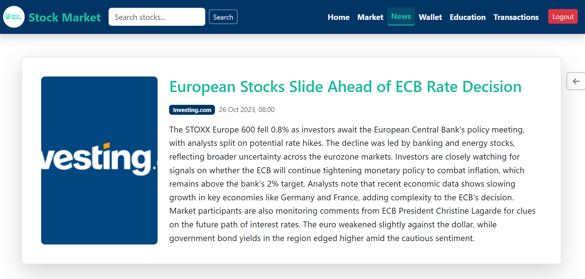

### 🔍 Search Sidebar
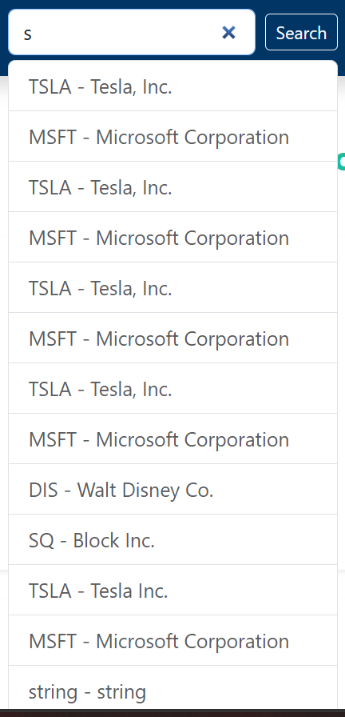

### 🔎 Search Page
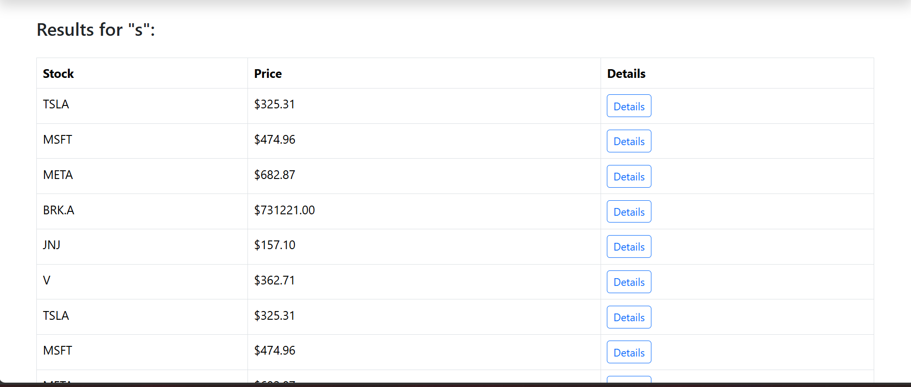

### 📈 Predict Stock
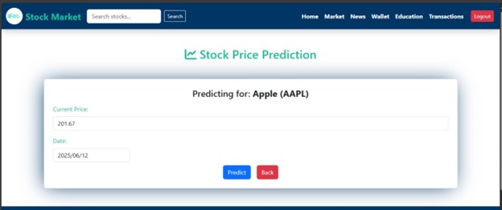

### 💼 Wallet
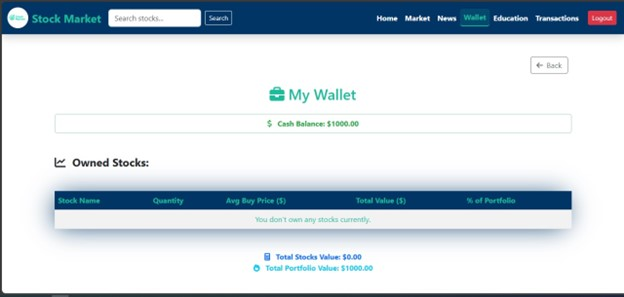

### 💳 Transaction
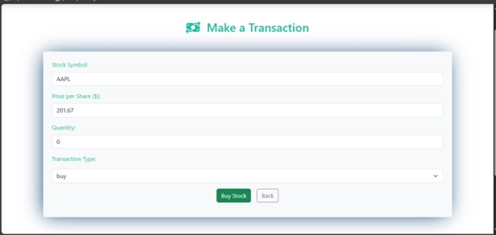

### 🧾 Transaction History
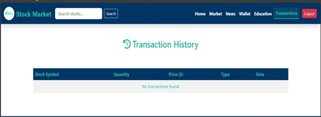

### 📦 Stock Options
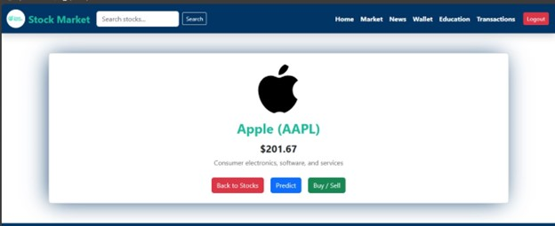

### 🦶 Footer


---

## 📈 Features

- ✅ Real-time stock prices
- ✅ Company search and filtering
- ✅ Visual trends with charting libraries
- ✅ Power BI dashboard embedded for business insights
- ✅ Machine learning model predicts stock price direction
- ✅ Responsive design for mobile/tablet/desktop

---

## 🧠 Power BI & Machine Learning

- **Power BI**: Interactive dashboards were created to display historical stock data, sector performance, and technical indicators.
- **ML Prediction**: A trained machine learning model predicts short-term stock trends based on historical performance and external indicators.

---

## 🛠️ Tech Stack

- **Frontend**: React.js, Bootstrap 
- **Visualization**: Power BI (embed)
- **Machine Learning**: Python, Scikit-learn (served predictions via API)
- **Backend**: C#, .NET 8, SQL Server

---

## 📁 Getting Started

```bash
git clone https://github.com/Abdelrahmanjr246/stock-market.git
cd stock-market
npm start
npm install
npm run dev
